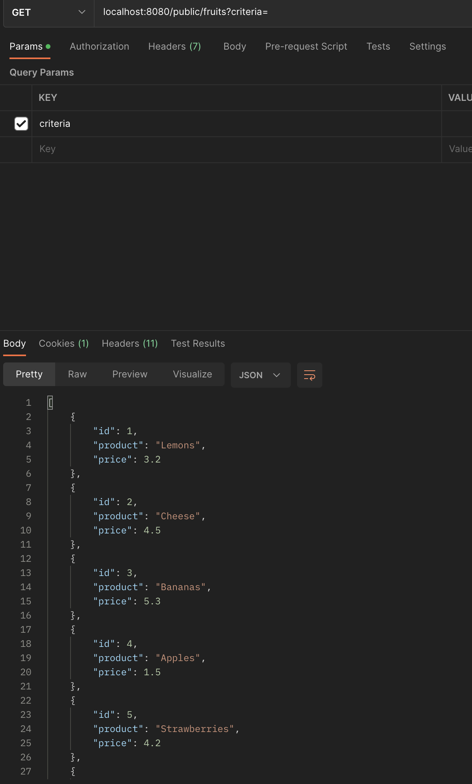
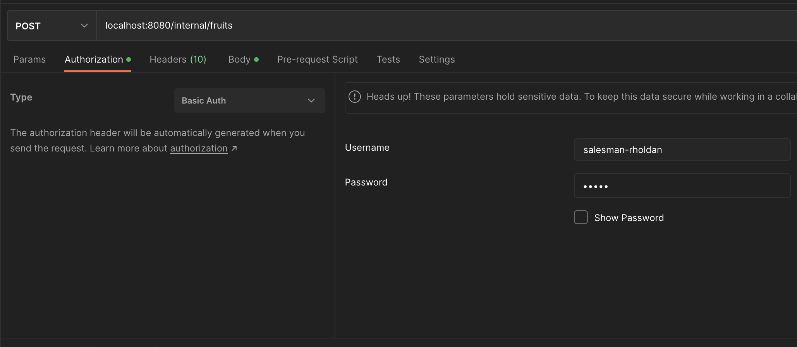
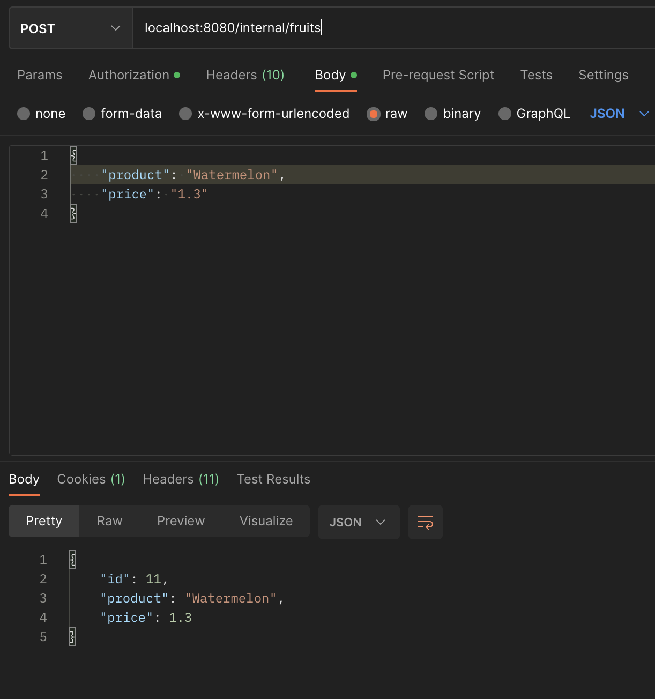
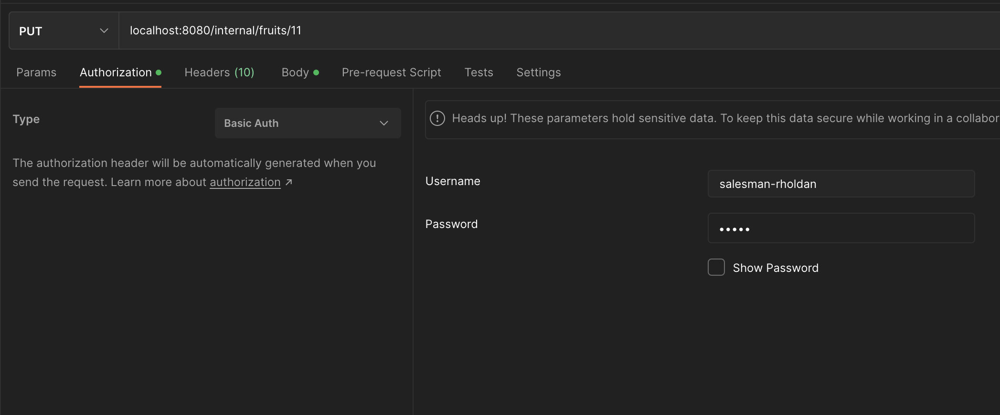
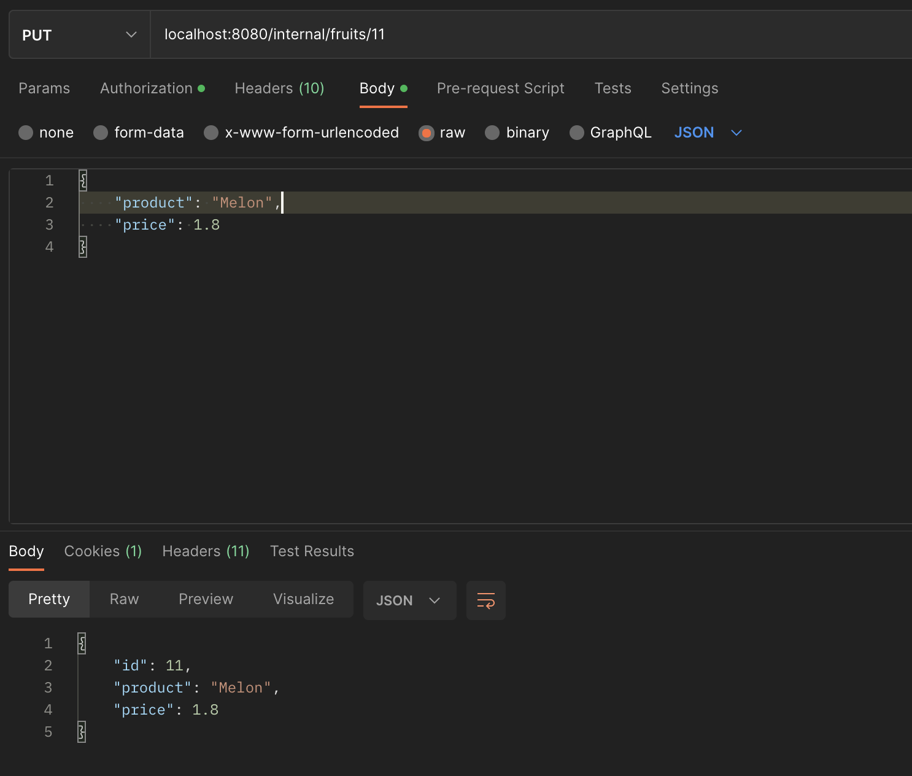

# Rholdan Fruits Store
Rholdan Fruits is a store using Spring boot application. It contains 2 sides:
1. <b>Public</b>: Let people to find/check fruits by criteria (product)
2. <b>Internal</b>: Let the salesman to admin fruits in the store

- [Github repository](https://github.com/roldanwilfrido/rholdan-fruits)


# Software Requirements

Project with the latest available versions of the following:

* [Spring Boot 3.0.0-RC1](https://spring.io/blog/2022/10/20/spring-boot-3-0-0-rc1-available-now) 
* Spring Web
* Spring Data JPA
* Spring Security ([Without ~~WebSecurityConfigurerAdapter~~](https://spring.io/blog/2022/02/21/spring-security-without-the-websecurityconfigureradapter))
  * In memory user case for Internal side "/internal/**" ([InMemoryUserDetailsManager.class](https://docs.spring.io/spring-security/site/docs/4.2.5.RELEASE/apidocs/org/springframework/security/provisioning/InMemoryUserDetailsManager.html))
  * Permit all for Public side "/public/**"
  * [BCryptPasswordEncoder.class](https://docs.spring.io/spring-security/site/docs/current/api/org/springframework/security/crypto/bcrypt/BCryptPasswordEncoder.html) for BCrypt hashing use
* Java 17 - **Check out [SDKMAN!](https://sdkman.io/)**
* Jakarta EE
* H2
* Gradle 7.5+


## Setup for IntelliJ

* Install "lombok" plugin & Enable: Settings -> Compiler -> Annotation Processor -> Enable annotation processing


## Running application

1. Compiling and running unit tests
```
./gradlew clean test bootJar
```
2. Starting the App
```
./gradlew bootRun
```

## Using application

### Public

- Get Fruits by criteria (product name)

<b>URL</b>: [GET] http://localhost:8080/public/fruits

Response:




### Internal

- Create Fruit

<b>URL</b>: [POST] http://localhost:8080/internal/fruits

```json
{
   "product": "Watermelon",
   "price": "1.3"
}
```
Response:



- Update Fruit

<b>URL</b>: [PUT] http://localhost:8080/internal/fruits/{id}

```json
{
   "product": "Melon",
   "price": "1.8"
}
```
Response:



## Exception handler

* Case #1: fruit already exist? [Calling POST]

```json
{
  "time": "2022-XX-XXThh:mm:ss.mmm",
  "status": 422,
  "message": "Fruit already exist!"
}
```

* Case #2: Missing fields? [Calling POST/PUT]

```json
{
  "time": "2022-XX-XXThh:mm:ss.mmm",
  "status": 400,
  "message": "Missing fields! Please check your input."
}
```

* Case #3: Wrong input? [Calling POST/PUT]

```json
{
  "time": "2022-XX-XXThh:mm:ss.mmm",
  "status": 400,
  "message": "Invalid input! Please check."
}
```

* Case #4: Wrong credentials? [Calling Internal endpoints]

Response: <i>401 Unauthorized</i>

## Details

* Controller (Spring web)
* Service (Spring Framework)
* Repository, Entity (Spring Data)
* Validations (Not null, NotEmpty, Entity exist/Entity not found - Jakarta EE)
* Exception handler (Spring web)

Any further information please email me to roldanhollow@gmail.com

[If you liked it, please buy me a 🥭 juice ✋🏻😁!](https://paypal.me/Sanidapp)

Enjoy!
